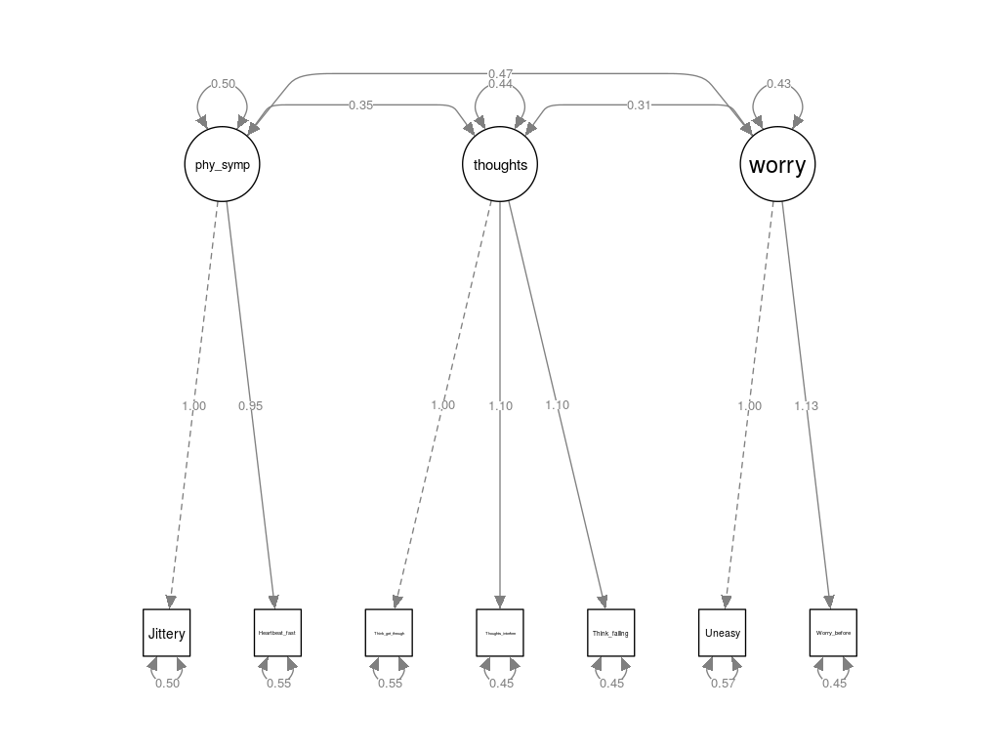

```{r setup, include=FALSE, message=FALSE}
knitr::opts_chunk$set(fig.pos = 'H', echo = FALSE, warning = FALSE)
library(knitr)
library(ggplot2)
library(tidyverse)
library(semPlot)
library(lavaan)
library(gmodels)

load("Anxeitydata.RData")
dat = as.data.frame(X)
```

# Abstract {-}

Nowadays there might be a large proportion of students who have psychological burdens regarding examination in school. To verify this assumption, we use structural equation model to further research the psychological status before and during the exam.

We tried to come up with some meaningful latent variables which can be measured by other variables and then make our assumptions. Using the dataset from Gierl and Rogers (1996) we built structural equation models with which we performed factor analysis.  

To map student anxiety regarding exams, which was represented by our latent variables, consisting of *physical symptoms*, *intrusive thoughts*, and *worry*, we worked our way up from using only one latent variable and adding more latent variables once the first one was rejected, due to not fitting our data. The full models, i.e. the ones that used all three latent variables, were evaluated using five different measures of model fit. We chose the model that was the best in the most amount of categories. This model did not completely match our expectations, as not all of the latent variables were highly correlated. However, the latent variable *Worry* was highly correlated with the other two latent variables. All our observable variables had a positive effect on their respective latent variables, and all of them were significant.

Thus, we conclude that an individual who is feeling worried and uneasy before an examination is more likely to be nervous during the examination.

\newpage

\tableofcontents

\newpage

# Introduction
 
The purpose of this assignment is to perform a factor analysis. The assignment is divided into two parts: one theoretical, where we try to come up with some meaningful latent variables which can be measured by other variables and then make our assumptions. The second is more practical - we use an actual dataset. The purpose of the second part of the assignment is to get some hands-on experience performing factor analysis, including estimation, interpretation and model checking. It is here that we will build structural equation models with which we will perform factor analysis. Our dataset for this task is from Gierl and Rogers (1996). The latent variable we want to model is test anxiety. We model this by using the variables form the dataset and successively build a structural equation model.
 
\newpage

# Theory

Using factor analysis, we try to solve a problem: there are variables that we want to measure, but we can not directly observe them, which are called latent variables. These can typically be rather complex variables, such as quality of life or general mental ability. Structural equation models (SEM) is a tool that can be used to try to measure these latent variables. We try to explain the variation in the unexplained, latent variables (factors), using observed, correlated variables. 

As an example we have IQ-tests. Here, IQ is the unknown factor that we want to measure. The actual measurement is done by a series of tests, which serve as the observable variables.

The structural equation models consist of two parts:

Measurement part:

- Factor model for the endogenous variables
- Factor model for the exogenous variables

Structural part:

- Model implied by theory

## Measurement part

Factor model for the endogenous variables - y as a function of latent variables $\eta$ :

$y_q = \alpha^{y}_{q1 \eta_{1}} + \alpha^{y}_{q2 \eta_{2}} + ... \alpha^{y}_{qs \eta_{s}} + \epsilon_{q}$ 

Factor model for the endogenous variables - x as a function of latent variables $\xi$ :

$y_q = \alpha^{x}_{p1 \xi_{1}} + \alpha^{x}_{p2 \xi_{2}} + ... \alpha^{x}_{ps \xi_{s}} + \epsilon_{p}$ 

Interpretation for factor loadings - standardize V(yi) = 1 and V($\eta$) = 1, then the OLS estimator 
$$\hat{\alpha} = (Cov(y, \eta)/V(\eta)) = \rho_{y, \eta}$$
and

$$V(\eta) = \hat{\alpha}^2 V(\eta) + V(\eta)$$
$$1 = \hat{\alpha}^2 + V(\eta)$$

$\hat{\alpha}^2$ is the proportion of the variance of y originating from the factor $\eta$
and $1-\hat{\alpha}^2$ from the error.

## Structural Part

The structural part consists of a regression model for each dependent latent variable as a function of:
- Other dependent latent variables, endogenous, $\eta$
- Latent exogenous variables, $\xi$

$$\eta_{s} = \beta_{s1}\eta_{1} + \beta_{s2}\eta_{2} + ... + \beta_{ss-1}\eta_{s-1} + \gamma_{s1}\xi_{1} + \gamma_{s2}\xi_{2} + \gamma_{sr}\xi_{r} + \zeta_{s}$$

\newpage

# Dataset

Our dataset is from Gierl, M.J. and Rogers, T. (1996) A Confirmatory Factor Analysis of the Test Anxeety Inventory Using Canadian High School Students, Educational and Psychological Measurement 56(2).

The variables of the dataset measure test-related anxiety of Canadian high school students. Our dataset contains observations from 335 male and 389 female high school students, of 20 variables each. 
However, we only use 7 variables and we do not use any gender variable.

For this study we only look at male students, disregarding the female students.

```{r}
table = dat
colnames(table) = c("jittery", "heart rate", "think get through", "think interfere", "think failing", "Worry before", "Uneasy")
table[1:8,] %>% 
  kable(digits = 2, caption = "Head 8 out of 335 observations")
```

\newpage

# Task 1

Our hypothetical occupation is being employed by the ministry of education. Our objective is to measure the degree of text anxiety among students, in order to learn more about why students do not like to take exams. We can assume this is a part of some long term study to to measure the mental health of students. 

We want to measure test anxiety, which is difficult since it can not be seen or captured using a single method. We decide to divide the latent variable "test anxiety" into three new latent variables. These new variables have the advantage of being more clearly defined. 

```{r}
options(knitr.kable.NA = '')
data.frame(latent = c("physical symptoms", NA, "intrusve thoughts", NA, NA, "worrying", NA),
           measurement = c("jittery", "heart_rate", "think_get_through", "thoughts_interfere", "Think_failing", "Worry_before", "Uneasy")) %>% 
   kable(caption = "Latent variables and Measurements")
```

Our new latent variables are:

- physical symptoms  (1) 

Physical symptoms cover intrusive physical stress symptoms, such as jitteriness or increased heart rate.

- intrusive thoughts (2) 

Intrusive thoughts cover mental disturbances during the test.

- worrying           (3) 

Worrying covers long term doubts of students, such as worrying about getting through school or passing tests.

Thus, we have broken "test anxiety" down into three different ways to measure test anxiety.

To measure the latent variables, we can use observable variables like the following:

- Being jittery during tests               (1)
- increased heart rate during a test       (1)
- thinking about finishing school          (2)
- Thoughts interfere with concentration    (2)
- thoughts about failing                   (2)
- Worrying about taking tests              (3)
- General unease                           (3)

Being jittery or having an increased heart rate during tests are easily measurable physical symptoms, so they can be used to explain physical symptoms of anxiety. The occurrence of intrusive thoughts regarding academic performance is a measure for  mental anxiety. We expect that general unease and worrying about tests will explain the  "worrying" in the long term. Thus, we have broken down the latent variable "test anxiety" into physical, mental and long term stress parts.

\newpage

# Task 2

```{r}
options(knitr.kable.NA = '')
data.frame(latent = c("physical symptoms", NA, "intrusve thoughts", NA, NA, "worrying", NA),
           measurement = c("jittery", "heart_rate", "think_get_through", "thoughts_interfere", "Think_failing", "Worry_before", "Uneasy")) %>% 
   kable(caption = "Latent variables and Measurements")
```

For people experiencing a high amount of stress, tests and performance can be scary and threatening. This results in students afflicted by both mental and physical symptoms. We expect all of these variables to be somewhat correlated with each other, as they are all expressions of test-related anxiety. Some of these variables are defined as occurring before exams and some occur during exams. Some variables are not defined in their relation to time, so we assume these variables to be constant, or at least occurring often. In general, we assume that all of our variables contribute to more test anxiety, so all of the variables should have a positive effect on their respective latent variables. Scoring a high score in all 3 latent categories would, in turn, mean that the individual is suffering a high amount of test-related anxiety.

## One factor model:

For a first attempt at factor modeling, we start with a one factor model:
We choose one latent variable: *Anxeity* and we fit it to being Uneasy, Jittery when taking tests, Worry before important tests, Heart beating fast during tests, Thinking about getting through school, Thoughts interfere with concentration, Think about failing.

```{r include=FALSE}
model <- '
   # latent variables
     anxeity =~ Uneasy + Think_get_through + Thoughts_interfere + Jittery + Worry_before + Think_failing + Heartbeat_fast
   # regressions

   # residual covariances
'

fit = cfa(model, data=dat)

s = summary(fit)
#s$PE
#semPaths(fit)
#semPaths(fit, what='std', nCharNodes=6, sizeMan=10,
         #edge.label.cex=1.25, curvePivot = TRUE, fade=FALSE)
#semPaths(fit,whatLabels="par", intercepts=FALSE, 
         #nCharNodes=0, residuals =TRUE,
         #nCharEdges=0, curveAdjacent = TRUE,title=TRUE,
         #layout="tree2",curvePivot=TRUE)

Eval1 = fitMeasures(fit, c("aic","bic" ,"cfi","rmsea","srmr"))
r2_1 = inspect(fit, 'r2')
```

*The measures for the latent variable Anxeity are all significant.*

- Holding all variables constant, a unit change in `r colnames(dat)[1]` would affect the Anxiety level by `r s$PE$est[1] `.

- Holding all variables constant, a unit change in `r colnames(dat)[2]` would affect the Anxiety level by `r s$PE$est[2] `.

- Holding all variables constant, a unit change in `r colnames(dat)[3]` would affect the Anxiety level by `r s$PE$est[3] `.

- Holding all variables constant, a unit change in `r colnames(dat)[4]` would affect the Anxiety level by `r s$PE$est[4] `.

- Holding all variables constant, a unit change in `r colnames(dat)[5]` would affect the Anxiety level by `r s$PE$est[5] `.

- Holding all variables constant, a unit change in `r colnames(dat)[6]` would affect the Anxiety level by `r s$PE$est[6] `.

- Holding all variables constant, a unit change in `r colnames(dat)[7]` would affect the Anxiety level by `r s$PE$est[7] `.

```{r}

allmodels1 = data.frame(Eval1)
allmodels1 = t(allmodels1)
rownames(allmodels1) = c("One-factor models")
kable(allmodels1, caption = "Evaluation of One-factor model", digits = 2)
```

We notice that the one-factor has elevated values for all our evaluation measures. Hence, the data does not really support the model. In fact, our measurements are more aligned with being in 3 different categories than just one category called *anxeity*. We can see that being Jittery and having a fast Heartbeat can be categorized into physical symptoms. Thinking about getting through school, Thoughts interfere with concentration and Think about failing are Intrusive thoughts. Being Uneasy and Worrying before an exam can be categorized as worrying. Hence, we obtain three latent variables.

## three-factor models

### Model 1

We now try having three 3 different categories: physical symptoms, Intrusive thoughts and worrying. Where  being Jittery and having a fast Heartbeat are measurements of physical symptoms. Thinking about getting through school, Thoughts interfere with concentration and Think about failing are measurements of Intrusive thoughts. Being Uneasy and Worrying before an exam are measurements of worrying.

```{r include=FALSE}
model <- '
   # latent variables
     phy_symp =~ Jittery + Heartbeat_fast
     thoughts =~ Think_get_through + Thoughts_interfere + Think_failing
     worry =~ Uneasy + Worry_before
   # regressions

   # residual covariances
'

fit = cfa(model, data=dat)

s = summary(fit)
#s$PE
#semPaths(fit)jians
#semPaths(fit, what='std', nCharNodes=6, sizeMan=10,
         #edge.label.cex=1.25, curvePivot = TRUE, fade=FALSE)
#semPaths(fit,whatLabels="par", intercepts=FALSE, 
         #nCharNodes=0, residuals =TRUE,
         #nCharEdges=0, curveAdjacent = TRUE,title=TRUE,
         #layout="tree2",curvePivot=TRUE)

Eval2 = fitMeasures(fit, c("aic","bic" ,"cfi","rmsea","srmr"))
r2_2 = inspect(fit, 'r2')
```

```{r fig.align="center", fig.cap="Model 1", out.width="70%"}

```

*The measures for the latent variable Physical symptoms are all significant.*

- Holding fast heartbeat constant, a unit change in Jitteriness would affect the Physical symptoms by `r s$PE$est[1] `.

- Holding fast Jitteriness, a unit change in heartbeat constant would affect the Physical symptoms by `r s$PE$est[2] `.

*The measures for the latent variable Intrusive thoughts are all significant.*

- Holding Thoughts interfere with concentration and Think about failing constant, a unit change in Thinking about getting through school would affect the Intrusive thoughts by `r s$PE$est[3] `.

- Holding Thinking about getting through school and Think about failing constant, a unit change in Thoughts interfere with concentration would affect the Intrusive thoughts by `r s$PE$est[4] `.

- Holding Thinking about getting through school and Thoughts interfere with concentration , a unit change in Think about failing constant would affect the Intrusive thoughts by `r s$PE$est[5] `.

*The measures for the latent variable Worrying are all significant.*

- Holding Worrying before exam constant, a unit change in Uneasiness would affect the Physical symptoms by `r s$PE$est[6] `.

- Holding Uneasiness constant, a unit change in Worrying before exam would affect the Physical symptoms by `r s$PE$est[6] `.

### Model 2

Similarly to the first model, we try having three 3 different categories: physical symptoms, Intrusive thoughts and worrying. Where  being Jittery and having a fast Heartbeat are measurements of physical symptoms. Thinking about getting through school, Thoughts interfere with concentration and Think about failing are measurements of Intrusive thoughts. Being Uneasy and Worrying before an exam are measurements of worrying. We now add regressions to the latent variables: physical symptoms is explained by uneasiness and worrying.

```{r include=FALSE}
model <- '
   # latent variables
     phy_symp =~ Jittery + Heartbeat_fast
     thoughts =~ Think_get_through + Thoughts_interfere + Think_failing
     worry =~ Uneasy + Worry_before
   # regressions
     phy_symp ~ worry + thoughts
   # residual covariances
'

fit = cfa(model, data=dat)

s = summary(fit)
#s$PE
#semPaths(fit)
#semPaths(fit, what='std', nCharNodes=6, sizeMan=10,
         #edge.label.cex=1.25, curvePivot = TRUE, fade=FALSE)
#semPaths(fit,whatLabels="par", intercepts=FALSE, 
         #nCharNodes=0, residuals =TRUE,
         #nCharEdges=0, curveAdjacent = TRUE,title=TRUE,
         #layout="tree2",curvePivot=TRUE)

Eval3 = fitMeasures(fit, c("aic","bic" ,"cfi","rmsea","srmr"))
r2_3 = inspect(fit, 'r2')
```

```{r fig.align="center", fig.cap="Model 2", out.width="70%"}
include_graphics("2.png")
```

*The measures for the latent variable Physical symptoms are all significant.*

- Holding fast heartbeat constant, a unit change in Jitteriness would affect the Physical symptoms by `r s$PE$est[1] `.

- Holding fast Jitteriness, a unit change in heartbeat constant would affect the Physical symptoms by `r s$PE$est[2] `.

*The measures for the latent variable Intrusive thoughts are all significant.*

- Holding Thoughts interfere with concentration and Think about failing constant, a unit change in Thinking about getting through school would affect the Intrusive thoughts by `r s$PE$est[3] `.

- Holding Thinking about getting through school and Think about failing constant, a unit change in Thoughts interfere with concentration would affect the Intrusive thoughts by `r s$PE$est[4] `.

- Holding Thinking about getting through school and Thoughts interfere with concentration , a unit change in Think about failing constant would affect the Intrusive thoughts by `r s$PE$est[5] `.

*The measures for the latent variable Worrying are all significant.*

- Holding Worrying before exam constant, a unit change in Uneasiness would affect the Physical symptoms by `r s$PE$est[6] `.

- Holding Uneasiness constant, a unit change in Worrying before exam would affect the Physical symptoms by `r s$PE$est[6] `.

**For the regressions, only worrying is significant for explaining physical symptoms. Thoughts before the exam are not significant.**


### Model 3

Similarly to the second model, we try having three 3 different categories: physical symptoms, Intrusive thoughts and worrying. Where  being Jittery and having a fast Heartbeat are measurements of physical symptoms. Thinking about getting through school, Thoughts interfere with concentration and Think about failing are measurements of Intrusive thoughts. Being Uneasy and Worrying before an exam are measurements of worrying. We remove thoughts before the exam from the regression since it was not significant in the last model.


```{r include=FALSE}
model <- '
   # latent variables
     phy_symp =~ Jittery + Heartbeat_fast
     thoughts =~ Think_get_through + Thoughts_interfere + Think_failing
     worry =~ Uneasy + Worry_before
   # regressions
     phy_symp ~ worry
   # residual covariances
'

fit = cfa(model, data=dat)

s = summary(fit)
#s$PE
#semPaths(fit)
#semPaths(fit, what='std', nCharNodes=6, sizeMan=10,
         #edge.label.cex=1.25, curvePivot = TRUE, fade=FALSE)
#semPaths(fit,whatLabels="par", intercepts=FALSE, 
         #nCharNodes=0, residuals =TRUE,
         #nCharEdges=0, curveAdjacent = TRUE,title=TRUE,
         #layout="tree2",curvePivot=TRUE)

Eval4 = fitMeasures(fit, c("aic","bic" ,"cfi","rmsea","srmr"))
r2_4 = inspect(fit, 'r2')
```

```{r fig.align="center", fig.cap="Model 3", out.width="70%"}
include_graphics("3.png")
```

*The measures for the latent variable Physical symptoms are all significant.*

- Holding fast heartbeat constant, a unit change in Jitteriness would affect the Physical symptoms by `r s$PE$est[1] `.

- Holding fast Jitteriness, a unit change in heartbeat constant would affect the Physical symptoms by `r s$PE$est[2] `.

*The measures for the latent variable Intrusive thoughts are all significant.*

- Holding Thoughts interfere with concentration and Think about failing constant, a unit change in Thinking about getting through school would affect the Intrusive thoughts by `r s$PE$est[3] `.

- Holding Thinking about getting through school and Think about failing constant, a unit change in Thoughts interfere with concentration would affect the Intrusive thoughts by `r s$PE$est[4] `.

- Holding Thinking about getting through school and Thoughts interfere with concentration , a unit change in Think about failing constant would affect the Intrusive thoughts by `r s$PE$est[5] `.

*The measures for the latent variable Worrying are all significant.*

- Holding Worrying before exam constant, a unit change in Uneasiness would affect the Physical symptoms by `r s$PE$est[6] `.

- Holding Uneasiness constant, a unit change in Worrying before exam would affect the Physical symptoms by `r s$PE$est[6] `.

**For the regressions, worrying is still significant for explaining physical symptoms.**

### Model 4

Similarly to the third  model, we try having three 3 different categories: physical symptoms, Intrusive thoughts and worrying. Where  being Jittery and having a fast Heartbeat are measurements of physical symptoms. Thinking about getting through school, Thoughts interfere with concentration and Think about failing are measurements of Intrusive thoughts. Being Uneasy and Worrying before an exam are measurements of worrying. We now have two regressions. Physical symptoms are explained with worrying and thoughts before the exam are also explained with worrying.


```{r include=FALSE}
model <- '
   # latent variables
     phy_symp =~ Jittery + Heartbeat_fast
     thoughts =~ Think_get_through + Thoughts_interfere + Think_failing
     worry =~ Uneasy + Worry_before
   # regressions
     phy_symp ~ worry
     thoughts ~ worry
   # residual covariances
'

fit = cfa(model, data=dat)

s = summary(fit)
#s$PE
#semPaths(fit)
#semPaths(fit, what='std', nCharNodes=6, sizeMan=10,
         #edge.label.cex=1.25, curvePivot = TRUE, fade=FALSE)
#semPaths(fit,whatLabels="par", intercepts=FALSE, 
         #nCharNodes=0, residuals =TRUE,
         #nCharEdges=0, curveAdjacent = TRUE,title=TRUE,
         #layout="tree2",curvePivot=TRUE)

Eval5 = fitMeasures(fit, c("aic","bic" ,"cfi","rmsea","srmr"))
r2_5 = inspect(fit, 'r2')
```

```{r fig.align="center", fig.cap="Model 4", out.width="70%"}
include_graphics("4.png")
```

*The measures for the latent variable Physical symptoms are all significant.*

- Holding fast heartbeat constant, a unit change in Jitteriness would affect the Physical symptoms by `r s$PE$est[1] `.

- Holding fast Jitteriness, a unit change in heartbeat constant would affect the Physical symptoms by `r s$PE$est[2] `.

*The measures for the latent variable Intrusive thoughts are all significant.*

- Holding Thoughts interfere with concentration and Think about failing constant, a unit change in Thinking about getting through school would affect the Intrusive thoughts by `r s$PE$est[3] `.

- Holding Thinking about getting through school and Think about failing constant, a unit change in Thoughts interfere with concentration would affect the Intrusive thoughts by `r s$PE$est[4] `.

- Holding Thinking about getting through school and Thoughts interfere with concentration , a unit change in Think about failing constant would affect the Intrusive thoughts by `r s$PE$est[5] `.

*The measures for the latent variable Worrying are all significant.*

- Holding Worrying before exam constant, a unit change in Uneasiness would affect the Physical symptoms by `r s$PE$est[6] `.

- Holding Uneasiness constant, a unit change in Worrying before exam would affect the Physical symptoms by `r s$PE$est[6] `.

**For the regressions, worrying still significant for explaining physical symptoms but it is not significant for physical symptoms.**

\newpage

### Models evaluation

We use a variety of methods to evaluate our models. We use AIC (Aikake information criterion) and BIC (Bayesian information criterion), to determine the strength of the models relative to each other. Additionally, we use CIF (Confirmatory factor analysis), RMSEA (root mean square error of approximation) and SRMR (Standardized Root Mean Square Residual) to determine model fit. We want all of these measurements to be as small as possible. The model with the smallest values is the model that we consider to be the best.

```{r include=FALSE}
Eval1
Eval2
Eval3
Eval4
Eval5
```

```{r}
allmodels = read.csv("allmodels.csv")
names(allmodels) = c("Model", "AIC", "BIC", "CFI", "RMSEA", "SRMR")
kable(allmodels, caption = "Evaluation of models", digits = c(0,0,0,2,2,3))
```

As we can see in the above table, model 3 has the smallest values in the categories AIC, BIC and RMSEA, the most out of any model. Thus we consider it to be our best model. For this model, physical symptoms and intrusive thoughts are not correlated. We expected all of the latent variables to be somewhat correlated, so this is not what we expected. However, both of these latent variables are correlated with worrying.

\newpage

## Fitted model

Our final model contains three different latent variables: physical symptoms, Intrusive thoughts and worrying. Where being Jittery and having a fast Heartbeat are measurements of physical symptoms. Thinking about getting through school, Thoughts interfere with concentration and Think about failing are measurements of Intrusive thoughts. Being Uneasy and Worrying before an exam are measurements of worrying. We now have one regression to the latent variables: physical symptoms is explained by worrying. Hence, the model as a path diagram is:

```{r eval=FALSE}
model <- '
   # latent variables
     phy_symp =~ Jittery + Heartbeat_fast
     thoughts =~ Think_get_through + Thoughts_interfere + Think_failing
     worry =~ Uneasy + Worry_before
   # regressions
     phy_symp ~ worry
   # residual covariances
'

fit = cfa(model, data=dat)

#s = summary(fit)
#s$PE
#semPaths(fit)
#semPaths(fit, what='std', nCharNodes=6, sizeMan=10,
         #edge.label.cex=1.25, curvePivot = TRUE, fade=FALSE)
pdf(file = "sem.pdf")
semPaths(fit, what = "paths", whatLabels="par", intercepts=FALSE, 
         nCharNodes=0, residuals =TRUE,
         nCharEdges=0, curveAdjacent = TRUE,title=TRUE,
         layout="tree2",curvePivot=TRUE)
dev.off()

#Eval4 = fitMeasures(fit, c("aic","bic" ,"cfi","rmsea","srmr"))
#r2_4 = inspect(fit, 'r2')
```

```{r fig.align="center", fig.cap="Fitted model", out.width="90%"}
include_graphics("sem.png")
```

\newpage

### Model in equation form:

**Measurement Part**

$$phy.sym=`r s$PE$est[1] ` Jittery + `r s$PE$est[2] ` Heartbeat.fast+ \epsilon_1$$
$$thoughts=`r s$PE$est[3] ` Think.gt.thrgh +`r s$PE$est[4] ` Thoughts.ntrfr + `r s$PE$est[5] ` Think.failing+ \epsilon_2$$
$$worry=`r s$PE$est[6] ` Uneasy + `r s$PE$est[7] ` worry.before+ \epsilon_3$$

**Structural Part**

$$phy.symp = `r s$PE$est[8] ` worry+ \zeta_1$$

### Model Interpretation

- The latent variable phy_sym can be interpreted as the true score that can not be observed stemming from the observed measurements Jittery and Heartbeat_fast.

- The latent variable thoughts can be interpreted as the true score that can not be observed stemming from the observed measurements Think_gt_thrgh, Thoughts_ntrfr and Think_failing.

- The latent variable worry can be interpreted as the true score that can not be observed stemming from the observed measurements Uneasy and worry_before.

### Scale for Latent Variables

In order to assign a scale for the latent variables, we calculated the estimated latent variables using the model. Then, for each latent variable we calculated the maximum and minimum values. We chose a scale from one to 10 for the three latent variables.

For each value of the latent variable we attribute a score from 1 to 10. Where 1 is starting from the minimum value until the minimum value plus a step. 10 is starting from the minimum value plus 9*step until the maximum value. The step is calculated by:

$$step = \frac{max-min}{10}$$

```{r}

lf= inspect(fit,what="std")$lambda

lf2 = as.data.frame(lf)

kable(lf2, caption = "Factor Loadings", digits = 2)
```

Jiteeriness and Fast heartbeat have respectively `r lf[1,1]` and `r lf[2,1]` lodgings which indicates that the factor physical symptoms strongly influences those variables. And all other variables have null lodgings which indicates that the factor physical symptoms has no influence on those variables.

Thinking about getting through school for Thoughts, Thoughts interfere with concentration and Think about failing have respectively `r lf[3,2]` , `r lf[4,2]` and `r lf[5,2]` lodgings which indicates that the factor Intrusive thoughts strongly influences those variables. all other variables have null lodgings which indicates that the factor Intrusive thoughts has no influence on those variables.

Uneasiness and Worrying before exam have respectively `r lf[6,3]` , `r lf[7,3]` and `r lf[5,2]` lodgings which indicates that the factor Worrying strongly influences those variables. all other variables have null lodgings which indicates that the factor Worrying has no influence on those variables.

Jitteriness seems to be a slightely stronger indicator than Faster heartbeat for physical symptoms. However they are very close.

Thoughts interfere with concentration and Think about failing are slightely stronger indicators than Thinking about getting through school for Thoughts. Worrying before an exams is a slightely stronger indicator than uneasiness for Worrying. 

Overall, we can say that all observed variables are equally strong indicators of the latent variables.

\newpage

# Conclusion

The purpose of this assignment is to gain some experience using factor modeling. Our dataset formed the basis for our latent variables which, in turn, formed our models. Our goal was to map student anxiety regarding exams. This was represented by our latent variables, consisting of physical symptoms, intrusive thoughts and worry. When creating the models, we worked our way up from using only one latent variable and adding more latent variables once the first one was rejected, due to not fitting our data. The full models, i.e. the ones that used all three latent variables, were evaluated using five different measures of model fit. We chose the model that was the best in the most amount of categories. This model did not completely match our expectations, as not all of the latent variables were highly correlated. However, the latent variable Worry was highly correlated with the other two latent variables. All our observable variables had a positive effect on their respective latent variables, and all of them were significant.

\newpage

# Appendix

## Detail of the best model

```{r}
summary(fit)
```

## Code for the whole article

```{r eval=FALSE, echo=TRUE, tidy=TRUE}
## ----setup, include=FALSE, message=FALSE-----------------------------------------------------------------
knitr::opts_chunk$set(fig.pos = 'H', echo = FALSE, warning = FALSE)
library(knitr)
library(ggplot2)
library(tidyverse)
library(semPlot)
library(lavaan)
library(gmodels)

load("Anxeitydata.RData")
dat = as.data.frame(X)


## --------------------------------------------------------------------------------------------------------
table = dat
colnames(table) = c("jittery", "heart rate", "think get through", "think interfere", "think failing", "Worry before", "Uneasy")
table[1:8,] %>% 
  kable(digits = 2, caption = "Head 8 out of 335 observations")


## --------------------------------------------------------------------------------------------------------
options(knitr.kable.NA = '')
data.frame(latent = c("physical symptoms", NA, "intrusve thoughts", NA, NA, "worrying", NA),
           measurement = c("jittery", "heart_rate", "think_get_through", "thoughts_interfere", "Think_failing", "Worry_before", "Uneasy")) %>% 
   kable(caption = "Latent variables and Measurements")


## --------------------------------------------------------------------------------------------------------
options(knitr.kable.NA = '')
data.frame(latent = c("physical symptoms", NA, "intrusve thoughts", NA, NA, "worrying", NA),
           measurement = c("jittery", "heart_rate", "think_get_through", "thoughts_interfere", "Think_failing", "Worry_before", "Uneasy")) %>% 
   kable(caption = "Latent variables and Measurements")


## ----include=FALSE---------------------------------------------------------------------------------------
model <- '
   # latent variables
     anxeity =~ Uneasy + Think_get_through + Thoughts_interfere + Jittery + Worry_before + Think_failing + Heartbeat_fast
   # regressions

   # residual covariances
'

fit = cfa(model, data=dat)

s = summary(fit)
#s$PE
#semPaths(fit)
#semPaths(fit, what='std', nCharNodes=6, sizeMan=10,
         #edge.label.cex=1.25, curvePivot = TRUE, fade=FALSE)
#semPaths(fit,whatLabels="par", intercepts=FALSE, 
         #nCharNodes=0, residuals =TRUE,
         #nCharEdges=0, curveAdjacent = TRUE,title=TRUE,
         #layout="tree2",curvePivot=TRUE)

Eval1 = fitMeasures(fit, c("aic","bic" ,"cfi","rmsea","srmr"))
r2_1 = inspect(fit, 'r2')


## --------------------------------------------------------------------------------------------------------

allmodels1 = data.frame(Eval1)
allmodels1 = t(allmodels1)
rownames(allmodels1) = c("One-factor models")
kable(allmodels1, caption = "Evaluation of One-factor model", digits = 2)


## ----include=FALSE---------------------------------------------------------------------------------------
model <- '
   # latent variables
     phy_symp =~ Jittery + Heartbeat_fast
     thoughts =~ Think_get_through + Thoughts_interfere + Think_failing
     worry =~ Uneasy + Worry_before
   # regressions

   # residual covariances
'

fit = cfa(model, data=dat)

s = summary(fit)
#s$PE
#semPaths(fit)jians
#semPaths(fit, what='std', nCharNodes=6, sizeMan=10,
         #edge.label.cex=1.25, curvePivot = TRUE, fade=FALSE)
#semPaths(fit,whatLabels="par", intercepts=FALSE, 
         #nCharNodes=0, residuals =TRUE,
         #nCharEdges=0, curveAdjacent = TRUE,title=TRUE,
         #layout="tree2",curvePivot=TRUE)

Eval2 = fitMeasures(fit, c("aic","bic" ,"cfi","rmsea","srmr"))
r2_2 = inspect(fit, 'r2')


## ----fig.align="center", fig.cap="Model 1", out.width="70%"----------------------------------------------


## ----include=FALSE---------------------------------------------------------------------------------------
model <- '
   # latent variables
     phy_symp =~ Jittery + Heartbeat_fast
     thoughts =~ Think_get_through + Thoughts_interfere + Think_failing
     worry =~ Uneasy + Worry_before
   # regressions
     phy_symp ~ worry + thoughts
   # residual covariances
'

fit = cfa(model, data=dat)

s = summary(fit)
#s$PE
#semPaths(fit)
#semPaths(fit, what='std', nCharNodes=6, sizeMan=10,
         #edge.label.cex=1.25, curvePivot = TRUE, fade=FALSE)
#semPaths(fit,whatLabels="par", intercepts=FALSE, 
         #nCharNodes=0, residuals =TRUE,
         #nCharEdges=0, curveAdjacent = TRUE,title=TRUE,
         #layout="tree2",curvePivot=TRUE)

Eval3 = fitMeasures(fit, c("aic","bic" ,"cfi","rmsea","srmr"))
r2_3 = inspect(fit, 'r2')


## ----fig.align="center", fig.cap="Model 2", out.width="70%"----------------------------------------------
include_graphics("2.png")


## ----include=FALSE---------------------------------------------------------------------------------------
model <- '
   # latent variables
     phy_symp =~ Jittery + Heartbeat_fast
     thoughts =~ Think_get_through + Thoughts_interfere + Think_failing
     worry =~ Uneasy + Worry_before
   # regressions
     phy_symp ~ worry
   # residual covariances
'

fit = cfa(model, data=dat)

s = summary(fit)
#s$PE
#semPaths(fit)
#semPaths(fit, what='std', nCharNodes=6, sizeMan=10,
         #edge.label.cex=1.25, curvePivot = TRUE, fade=FALSE)
#semPaths(fit,whatLabels="par", intercepts=FALSE, 
         #nCharNodes=0, residuals =TRUE,
         #nCharEdges=0, curveAdjacent = TRUE,title=TRUE,
         #layout="tree2",curvePivot=TRUE)

Eval4 = fitMeasures(fit, c("aic","bic" ,"cfi","rmsea","srmr"))
r2_4 = inspect(fit, 'r2')


## ----fig.align="center", fig.cap="Model 3", out.width="70%"----------------------------------------------
include_graphics("3.png")


## ----include=FALSE---------------------------------------------------------------------------------------
model <- '
   # latent variables
     phy_symp =~ Jittery + Heartbeat_fast
     thoughts =~ Think_get_through + Thoughts_interfere + Think_failing
     worry =~ Uneasy + Worry_before
   # regressions
     phy_symp ~ worry
     thoughts ~ worry
   # residual covariances
'

fit = cfa(model, data=dat)

s = summary(fit)
#s$PE
#semPaths(fit)
#semPaths(fit, what='std', nCharNodes=6, sizeMan=10,
         #edge.label.cex=1.25, curvePivot = TRUE, fade=FALSE)
#semPaths(fit,whatLabels="par", intercepts=FALSE, 
         #nCharNodes=0, residuals =TRUE,
         #nCharEdges=0, curveAdjacent = TRUE,title=TRUE,
         #layout="tree2",curvePivot=TRUE)

Eval5 = fitMeasures(fit, c("aic","bic" ,"cfi","rmsea","srmr"))
r2_5 = inspect(fit, 'r2')


## ----fig.align="center", fig.cap="Model 4", out.width="70%"----------------------------------------------
include_graphics("4.png")


## ----include=FALSE---------------------------------------------------------------------------------------
Eval1
Eval2
Eval3
Eval4
Eval5


## --------------------------------------------------------------------------------------------------------
allmodels = read.csv("allmodels.csv")
names(allmodels) = c("Model", "AIC", "BIC", "CFI", "RMSEA", "SRMR")
kable(allmodels, caption = "Evaluation of models", digits = c(0,0,0,2,2,3))


## ----eval=FALSE------------------------------------------------------------------------------------------
## model <- '
##    # latent variables
##      phy_symp =~ Jittery + Heartbeat_fast
##      thoughts =~ Think_get_through + Thoughts_interfere + Think_failing
##      worry =~ Uneasy + Worry_before
##    # regressions
##      phy_symp ~ worry
##    # residual covariances
## '
## 
## fit = cfa(model, data=dat)
## 
## #s = summary(fit)
## #s$PE
## #semPaths(fit)
## #semPaths(fit, what='std', nCharNodes=6, sizeMan=10,
##          #edge.label.cex=1.25, curvePivot = TRUE, fade=FALSE)
## pdf(file = "sem.pdf")
## semPaths(fit, what = "paths", whatLabels="par", intercepts=FALSE,
##          nCharNodes=0, residuals =TRUE,
##          nCharEdges=0, curveAdjacent = TRUE,title=TRUE,
##          layout="tree2",curvePivot=TRUE)
## dev.off()
## 
## #Eval4 = fitMeasures(fit, c("aic","bic" ,"cfi","rmsea","srmr"))
## #r2_4 = inspect(fit, 'r2')


## ----fig.align="center", fig.cap="Fitted model", out.width="90%"-----------------------------------------
include_graphics("sem.png")


## --------------------------------------------------------------------------------------------------------

lf= inspect(fit,what="std")$lambda

lf2 = as.data.frame(lf)

kable(lf2, caption = "Factor Loadings", digits = 2)


## --------------------------------------------------------------------------------------------------------
summary(fit)


## ----eval=FALSE, echo=TRUE, tidy=TRUE--------------------------------------------------------------------
## #purl("HW2.Rmd", output = "code2.R")


```

