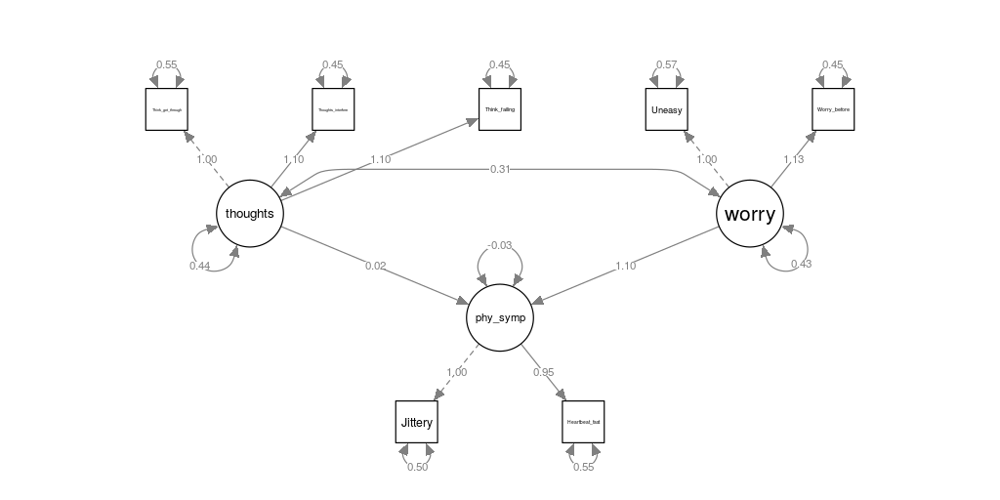

```{r setup, include=FALSE}
knitr::opts_chunk$set(echo = FALSE, warning = FALSE)

library(knitr)
library(reshape2)
library(ggplot2)
library(moments)
library(dummies)
library(tidyverse)
library(DT)
library(lmtest)
library(sjPlot)
library(ROCR)
library(POCRE)
library(caret)
library(semPlot)
library(lavaan)
library(gmodels)

load("Anxeitydata.RData")
dat = as.data.frame(X)

```


# Introduction

## latent variables and Factor analysis 

Latent variables = variables we can not observe


We have to define them in terms of other variables


Factor analysis = We use observed, correlated variables to describe the variation in the factor (latent variable)


We use SEM - Structural Equation Modeling, to make our causal models.


## Dataset - Test anxiety

Dataset is from 1996


Measures test anxiety of Canadian high school students.


It contains 724 observations and 20 variables, from which we use 335 observations (the male students) and 7 variables.

## Our variables

The variables we use from our dataset are the following:


1. Uneasy, upset feeling


2. Jittery when taking tests


3. Worry before important tests


4. Heart beating fast during tests


5. Thinking about getting through school


6. Thoughts interfere with concentration


7. Think about failing

## Latent variables

We wish to observe latent variables that are expressions of test anxiety. We have divided them into 3 different factors:


1. physical symptoms (#2, #4)


2. intrusive thoughts (#5, #6, #7)


3. worrying (#1, #3)

# Result

## Expectations 

We expect our factors to be positively correlated with each other.

We expect that all our variables have a positive effect on their respective latent variables.

## One factor model

```{r out.width="50%"}
include_graphics("factor.png")
```

## Three factor model -  model 1

```{r out.width="50%"}
include_graphics("1.png")
```

## Three factor model -  model 2

```{r out.width="50%"}

```

## Three factor model -  model 3

```{r out.width="50%"}
include_graphics("3.png")
```

## Three factor model -  model 4


```{r out.width="50%"}
include_graphics("4.png")
```

# Evaluation 

## Evaluation

We use the following measures to evaluate our models:


-AIC (AKAIKE INFMORMATION CRITERION)


-BIC (BAYESIAN INFORMATION CRITERION)


-CFI (COMPARATIVE FIT INDEX)


-RMSEA (ROOT MEAN SQUARE ERROR of APPROXIMATION) 


-SRMR (STANDARDISED ROOT MEAN SQUARE RESIDUAL)

## Evaluation table

```{r}
allmodels = read.csv("allmodels.csv")

kable(allmodels, caption = "Evaluation of models", digits = 3)
```

Since model 3 wins in 3 categories, we consider it to be our best model.

## Final model

```{r out.width="50%"}
include_graphics("3.png")
```

## Final model scaling

Scale: 1 is starting from the minimum value until the minimum value plus a step. 


10 is starting from the minimum value plus 9*step until the maximum value. 


The step is calculated by:
$$step = \frac{max-min}{10}$$

## Factor lodgning table

```{r}
model <- '
   # latent variables
     phy_symp =~ Jittery + Heartbeat_fast
     thoughts =~ Think_get_through + Thoughts_interfere + Think_failing
     worry =~ Uneasy + Worry_before
   # regressions
     phy_symp ~ worry
   # residual covariances
'

fit = cfa(model, data=dat)


lf= inspect(fit,what="std")$lambda

lf2 = as.data.frame(lf)

kable(lf2, caption = "Factor Loadings", digits = 2)
```


## Conclusion

Among our three factor models, we found that our third model (which had a regression between physical symptoms and worry) was the best model.