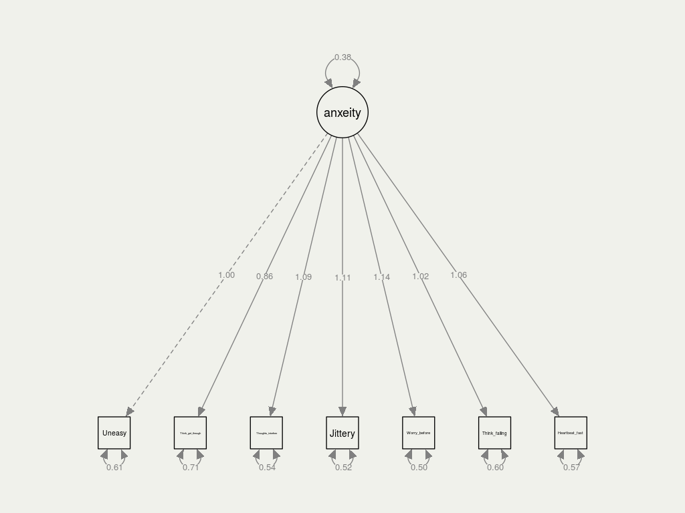
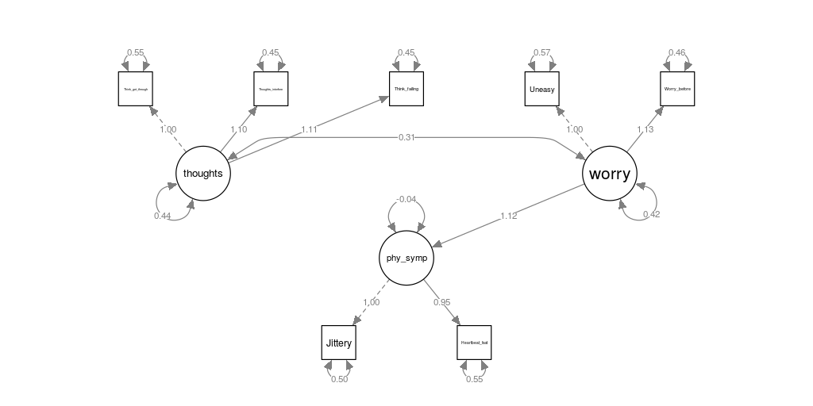
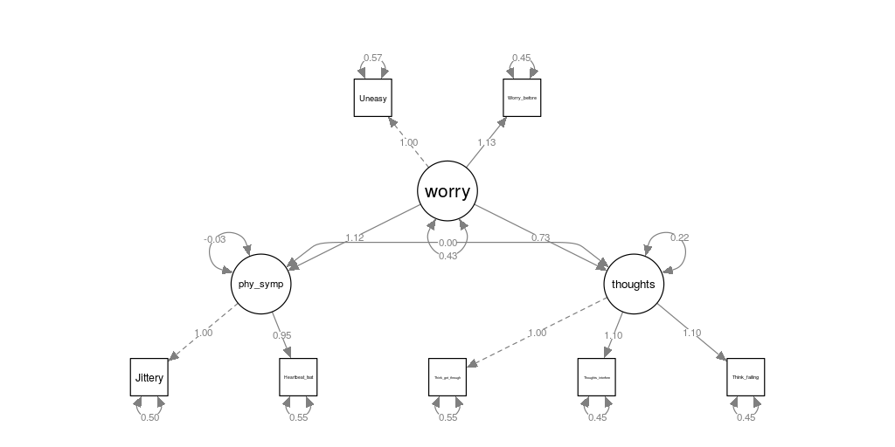

```{r setup, include=FALSE}
knitr::opts_chunk$set(echo = FALSE, warning = FALSE)

library(knitr)
library(reshape2)
library(ggplot2)
library(moments)
library(dummies)
library(tidyverse)
library(DT)
library(lmtest)
library(sjPlot)
library(ROCR)
library(POCRE)
library(caret)
library(semPlot)
library(lavaan)
library(gmodels)

load("Anxeitydata.RData")
dat = as.data.frame(X)

```


# Introduction

## latent variables and Factor analysis 

\  

Latent variables = variables we can not observe


We have to define them in terms of other variables


Factor analysis = We use observed, correlated variables to describe the variation in the factor (latent variable)


We use SEM - Structural Equation Modeling, to make our causal models.


## Dataset - Test anxiety

\  

Dataset is from 1996


Measures test anxiety of Canadian high school students.


It contains 724 observations and 20 variables, from which we use 335 observations (the male students) and 7 variables.

## Our variables

\  

The variables we use from our dataset are the following:


1. Uneasy, upset feeling


2. Jittery when taking tests


3. Worry before important tests


4. Heart beating fast during tests


5. Thinking about getting through school


6. Thoughts interfere with concentration


7. Think about failing

## Latent variables

\  

We wish to observe latent variables that are expressions of test anxiety. We have divided them into 3 different factors:


1. physical symptoms (#2, #4)


2. intrusive thoughts (#5, #6, #7)


3. worrying (#1, #3)

# Models

## Quote

\  

> In God we trust. All others must bring data.

 
<small>

by

W. Edwards Deming, 

statistician

</small>

## Data Speak

\  

```{r}
table = dat
colnames(table) = c("jittery", "heart rate", "think get through", "think interfere", "think failing", "Worry before", "Uneasy")
table[1:8,] %>% 
  kable(digits = 2, caption = "Head 8 out of 335 observations")
```

## Expectations 1

\  

We expect that:

\  

> all the measurements
> 
> have positive effect
> 
> on the latent variable

## One-factor model

```{r out.width="80%"}

```

## Three-factor models

\  

```{r}
options(knitr.kable.NA = '')
data.frame(latent = c("physical symptoms", NA, "intrusve thoughts", NA, NA, "worrying", NA),
           measurement = c("jittery", "heart_rate", "think_get_through", "thoughts_interfere", "Think_failing", "Worry_before", "Uneasy")) %>% 
   kable(caption = "Latent variables and Measurements")
```

## Expectations 2

\  

We expect that:

\  

> physical symptoms,
> 
> intrusve thoughts,
> 
> and worrying
> 
> positively correlated with each other

## Three-factor models -  model 1

```{r out.width="80%"}
include_graphics("1.png")
```

## Three-factor models -  model 2

```{r eval=FALSE, echo=TRUE}
sem(phy_symp ~ worry + thoughts)
```

```{r out.width="80%"}
include_graphics("2.png")
```

## Three-factor models -  model 3

```{r eval=FALSE, echo=TRUE}
sem(phy_symp ~ worry)
```

```{r out.width="80%"}

```

## Three-factor models -  model 4

```{r eval=FALSE, echo=TRUE}
phy_symp ~ worry
thoughts ~ worry
```

```{r out.width="80%"}

```

## Evaluation

```{r out.width="80%"}
allmodels = read.csv("allmodels.csv")
names(allmodels) = c("Model", "AIC", "BIC", "CFI", "RMSEA", "SRMR")
kable(allmodels, caption = "Evaluation of models", digits = c(0,0,0,2,2,3))
```

<small>

AIC (akaike information criterion)

BIC (bayesian information criterion)

CFI (comparative fit index)

RMSEA (root mean square error of approximation)

SRMR (Standardized Root Mean Square Residual)

</small>

# Final model

## Final model

```{r out.width="80%"}

```

## Final model scaling

\  

Scale: 1 is starting from the minimum value until the minimum value plus a step. 


10 is starting from the minimum value plus 9*step until the maximum value. 


The step is calculated by:

$$step = \frac{max-min}{10}$$

## Factor Lodging Table

\  

```{r}
model <- '
   # latent variables
     phy_symp =~ Jittery + Heartbeat_fast
     thoughts =~ Think_get_through + Thoughts_interfere + Think_failing
     worry =~ Uneasy + Worry_before
   # regressions
     phy_symp ~ worry
   # residual covariances
'

fit = cfa(model, data=dat)


lf= inspect(fit,what="std")$lambda

lf2 = as.data.frame(lf)

kable(lf2, caption = "Factor Lodging", digits = 2)
```

## Conclusion

\

An individual 

who is feeling worried and uneasey before an examination 

is more likely to be nervous during the examination.

## Thanks for watching

\  

> Author:
>
> Claes Kock
>
> Mayara Latrech
>
> Yuchong Wu

<small>

This presentation can be found on:

[www.yu-chong.com/projects/factor](https://www.yu-chong.com/projects/factor)

Feedback would be welcomed!

</small>